# Chapter 1

# Introduction

In the modern era of rapid technological advancement, academic institutions and research laboratories are increasingly relying on digital infrastructure to establish a global presence. A well-designed digital portal serves as the primary gateway for knowledge dissemination, interdisciplinary collaboration, and public engagement. For specialized research entities like the ViBeS (Vibrations and Behaviours of Structures) Lab, having a centralized, dynamic, and easily navigable platform is not just a modern convenience—it is a foundational requirement for academic outreach. Such platforms allow researchers to showcase their ongoing projects, publish peer-reviewed papers, and highlight the achievements of the lab's members to a worldwide audience. 

However, as the scale of research output increases, traditional static web portals often fail to deliver an optimal user experience. Visitors typically face information overload, forced to manually parse through extensive publication lists and complex project blueprints to find specific data. To address this paradigm shift, there is a growing need to integrate intelligent systems capable of parsing, understanding, and retrieving domain-specific knowledge instantaneously. The recent breakthroughs in Generative Artificial Intelligence (AI), particularly the advent of Small Language Models (SLMs) and Retrieval-Augmented Generation (RAG) frameworks, present a unique opportunity to build sophisticated conversational agents directly into academic websites. 

This project aims to revolutionize the digital footprint of the ViBeS Lab by developing a comprehensive, full-stack web application integrated seamlessly with a privacy-preserving AI Chatbot. Unlike generic cloud-based AI solutions, this system is uniquely engineered to run locally, ensuring that proprietary lab data remains secure and operating costs remain nonexistent. By combining a modern React-based frontend, a robust Express and MongoDB backend, and an advanced Python-based vector search pipeline (LanceDB), the system creates an ecosystem where users can interact with the lab’s knowledge base using natural language. The AI assistant can accurately retrieve and summarize publications, explain ongoing research, and provide details about lab members instantly.

This report documents the end-to-end development, architecture, and implementation of the ViBeS Lab Website and its AI ecosystem. It serves both as a project report and a comprehensive developer maintenance manual, detailing the methodologies, technologies, and testing procedures utilized to bring this intelligent platform to life. The subsequent sections of this chapter will delve into the background context that necessitated this project, the primary motivations driving its technical design choices, and the specific objectives it seeks to accomplish.

*(Note: Insert a Page Break here in your Word document so that 1.1 Background starts on the top of Page 2.)*

---

## 1.1 Background
In the contemporary academic and scientific environment, a robust digital presence is essential for research laboratories to disseminate their findings, attract prospective talent, secure funding, and foster global collaborations. Research laboratories act as the primary engines of innovation within universities, producing a vast amount of intellectual property on a continuous basis. This includes peer-reviewed publications, ongoing project blueprints, empirical datasets, conference presentations, and technical reports. Managing, archiving, and presenting this wealth of information in an accessible, structured manner is a critical operational requirement. 

Historically, academic institutions have relied on conventional, static websites or rigid Content Management Systems (CMS) to host their portfolios. However, as the volume of information grows exponentially, these traditional navigational structures—often consisting of nested menus and rudimentary keyword-based search bars—become highly inefficient. Users, ranging from prospective graduate students to industry collaborators, often find themselves sifting through dense, unstructured web pages merely to extract specific, nuanced information regarding a lab's activities or a specific researcher's expertise. 

The ViBeS Lab, a forward-looking research entity, recognized this bottleneck and identified the need for a dedicated, centralized, and highly interactive web platform. The goal was not only to showcase its members, achievements, and research outputs aesthetically but also to revolutionize how visitors interact with the lab's knowledge base. 

The recent advent and rapid proliferation of Generative Artificial Intelligence (AI) and Natural Language Processing (NLP) provide an unprecedented opportunity to augment traditional web interfaces. Large Language Models (LLMs) have fundamentally transformed human-computer interaction by allowing users to converse with machines using natural, everyday language. However, deploying generic, commercial cloud-based LLMs in a research setting introduces significant challenges, primarily concerning the data privacy of unpublished research, intellectual property security, and the recurring costs associated with commercial API inference. Furthermore, generic models often hallucinate or provide factually incorrect answers when queried about highly specialized, niche academic topics that were not heavily featured in their pre-training data.

To overcome these limitations, this project leverages modern architectural advancements by developing a full-stack, AI-integrated web application tailored specifically for the ViBeS Lab. Built using a modern React-based frontend (Vite) and a highly scalable Express (Node.js) backend, it includes a dynamic MongoDB database to handle structured lab data. 

Most importantly, to power the intelligent assistant without compromising data privacy or accuracy, the system introduces a localized AI Chatbot. This is achieved through the design and implementation of an advanced Retrieval-Augmented Generation (RAG) pipeline. RAG effectively bridges the gap between static knowledge bases and dynamic generative capabilities by allowing the AI to "read" the lab's specific documents before answering. By utilizing a local vector database (LanceDB) for semantic search and a Small Language Model (SLM) running directly on the host server via Ollama, the ViBeS Lab website ensures that all natural language interactions are secure, cost-effective, and strictly grounded in the lab's proprietary truth.

*(Note: Insert a Page Break here in your Word document so that 1.2 Motivation starts on the top of Page 3.)*

---

## 1.2 Motivation
The primary motivation behind this project is to bridge the gap between complex academic research and public accessibility, while simultaneously modernizing the digital infrastructure of the ViBeS Lab. Students, industry professionals, and researchers visiting an academic lab's website often experience a steep learning curve. They spend significant time parsing through dense publications, nested project pages, and abstract technical reports to find specific, actionable details. Existing academic lab websites rely heavily on static, Web 2.0 architectures and conventional, lexical keyword-based search mechanisms. This paradigm poses severe challenges: critical information overload, a frustrating lack of user interactivity, and tedious manual maintenance overhead for the lab administrators who must manually update the HTML files. 

Furthermore, while commercial Large Language Models (LLMs) like OpenAI's GPT-4 or Anthropic's Claude offer excellent conversational capabilities, relying on them for an academic website introduces a host of structural problems. These include unpredictable recurring API costs, external latency dependencies, and severe data privacy risks regarding unpublished, highly sensitive scientific research. Sending proprietary research data to external third-party servers is often a violation of institutional data governance policies. 

This critical privacy and cost limitation heavily motivated the transition from a traditional static system to a dynamic, localized AI ecosystem. By combining a local Small Language Model (SLM) with a custom Retrieval-Augmented Generation (RAG) architecture, the proposed system ensures absolute data sovereignty. It provides zero recurring inference costs, circumvents external network dependencies, and delivers highly accurate, context-specific responses grounded entirely in the ViBeS lab's trusted data repository.

**Table 1.1** below provides a detailed comparison between the existing static paradigm and the proposed dynamic AI-integrated system.

### Table 1.1: Comparison between Existing System and Proposed System

| Feature | Existing System | Proposed System |
| :--- | :--- | :--- |
| **Architecture** | Static Pages or Basic CMS | Dynamic SPA (React + Express + MongoDB) |
| **Search Mechanism** | Basic Keyword Search | Semantic Search using Vector Embeddings (RAG) |
| **Interactivity** | Manual navigation through menus | Conversational AI Chatbot |
| **Data Privacy** | N/A (No AI) | High (Local SLM via Ollama) |
| **Operating Cost** | Hosting costs only | Hosting costs only (Zero recurring API fees for AI) |

*(Figure 1.1 below illustrates the workflow differences between the two systems)*

```mermaid
%%{init: {'theme': 'base', 'themeVariables': { 'background': '#ffffff', 'primaryColor': '#ffffff', 'secondaryColor': '#ffffff', 'tertiaryColor': '#ffffff', 'primaryBorderColor': '#000000', 'primaryTextColor': '#000000', 'secondaryBorderColor': '#000000', 'secondaryTextColor': '#000000', 'tertiaryBorderColor': '#000000', 'tertiaryTextColor': '#000000', 'lineColor': '#000000', 'textColor': '#000000', 'clusterBkg': '#ffffff', 'clusterBorder': '#000000', 'titleColor': '#000000', 'edgeLabelBackground': '#ffffff', 'nodeBorder': '#000000', 'mainBkg': '#ffffff'}}}%%
flowchart TD
    subgraph Existing System
        A1[User] -->|Searches Keyword| B1[Static Website]
        B1 -->|Lexical Match| C1[Standard Database]
        C1 -->|Returns List of Links| B1
    end

    subgraph Proposed System
        A2[User] -->|Asks Question| B2[React Frontend + AI Chatbot]
        B2 -->|API Request| C2[Node.js Backend]
        C2 -->|Query Embedding| D2[Python RAG Service]
        D2 -->|Semantic Search| E2[(LanceDB Vector DB)]
        E2 -->|Retrieved Context| D2
        D2 -->|Context + Prompt| F2[Local SLM - Ollama]
        F2 -->|Generated Answer| C2
        C2 -->|Streams Response| B2
    end
```

## 1.3 Objectives of the work
The primary objective of this project is to design, develop, and deploy a comprehensive web portal for the ViBeS Lab featuring a highly secure, privacy-preserving conversational AI. 

The specific sub-objectives necessary to achieve this overarching goal include:
1. **Responsive Frontend Development:** Create an intuitive, accessible, and aesthetically pleasing User Interface (UI) for the ViBeS Lab using React and Tailwind CSS, ensuring cross-device compatibility.
2. **Robust Backend Architecture:** Implement a secure, highly scalable Node.js and Express backend connected to a MongoDB document database for dynamic data management and efficient API routing.
3. **Advanced RAG Pipeline Implementation:** Engineer a state-of-the-art document ingestion and semantic retrieval system using LanceDB as the vector store and HuggingFace MiniLM models for generating high-quality text embeddings.
4. **Local AI Chatbot Integration:** Deploy an open-weights SLM via Ollama to serve as the reasoning engine of the chatbot, guaranteeing that the AI provides accurate answers firmly grounded in the retrieved context without hallucinating.
5. **Developer Maintainability:** Architect the entire system in a modular fashion, providing comprehensive developer documentation to ensure that future contributors can easily upgrade the embedding model or swap out the SLM without rewriting core components.

**Scope and Expected Outcomes:**
The scope of this project encompasses the end-to-end development of the website, including all user-facing pages, administrative dashboards, RESTful APIs, Python scripts for vector embeddings, and the local SLM inference setup. The expected outcome is a high-performance digital portal that effectively showcases the lab's research, alongside a functional, secure AI chatbot embedded within the site that can synthesize complex academic data and answer user queries in real-time, completely cost-free and privacy-preserving.

**Table 1.2** outlines the necessary software and hardware specifications required to deploy and maintain this proposed system effectively.

### Table 1.2: Software and Hardware Requirements

| Requirement Type | Specification |
| :--- | :--- |
| **Frontend Technologies** | React.js, Vite, Tailwind CSS, TypeScript, Radix UI |
| **Backend Technologies** | Node.js, Express.js, TypeScript |
| **Database** | MongoDB (Mongoose ORM) |
| **Vector Database** | LanceDB |
| **AI / Machine Learning** | Ollama (SLM Inference), LangChain, HuggingFace (MiniLM, Cross-Encoder) |
| **Languages** | TypeScript, Python |
| **Minimum Hardware (Deployment)** | 4-Core CPU, 8GB RAM (16GB Recommended for local SLM), 50GB SSD |
| **Operating System** | Linux (Ubuntu 20.04+) or Windows 10/11 with WSL2 |
