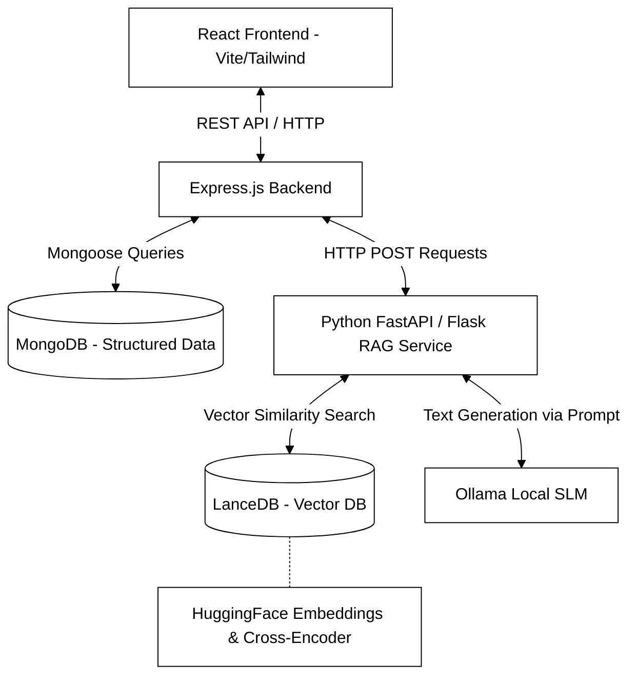

# Chapter 2

# Methodology

This chapter details the overarching methodology, theoretical foundations, and system architecture utilized to develop the ViBeS Lab Website and its integrated AI Chatbot. Designing a modern web platform augmented with a localized Artificial Intelligence ecosystem requires careful consideration of various architectural paradigms. The system was designed following a modern, decoupled, microservices-inspired architecture to ensure strict modularity, high scalability, and ease of future maintenance. By isolating distinct computational responsibilities into separate domains, the system prevents bottlenecks and allows individual components to be upgraded independently without disrupting the entire platform. The ecosystem is broadly divided into distinct but highly synchronized components: the client-facing frontend, the central administrative backend, the document-based database, and the Python-based Retrieval-Augmented Generation (RAG) service powered by a local Small Language Model (SLM).

## 2.1 System Architecture
The foundational blueprint of the ViBeS Lab platform is based on a multi-tier client-server architectural pattern. In traditional monolithic architectures, the user interface, business logic, and database management are tightly coupled into a single executable codebase. While this is easier to deploy initially, it scales poorly and becomes extremely difficult to maintain as project complexity grows. To avoid these pitfalls, a distributed architecture was implemented. By separating the user interface, business logic, data persistence, and AI inference engines into distinct, loosely coupled modules, the system guarantees high performance, fault tolerance, and security.

This architecture strictly enforces the principle of Separation of Concerns (SoC). The presentation tier focuses entirely on user experience and rendering; the application tier manages secure data routing and authentication; the persistence tier handles structured data integrity; and the AI tier is optimized specifically for computationally heavy tasks like vector mathematics and neural network inference.

*(Insert **Figure 2.1: High-Level System Architecture of ViBeS Lab Website** here)*

### 2.1.1 Frontend and Backend
**Frontend Architecture:**
The frontend tier is engineered as a dynamic Single Page Application (SPA) using **React**, accelerated by the **Vite** build tool. React was selected over traditional server-rendered HTML frameworks due to its component-based architecture and its highly efficient Virtual Document Object Model (DOM). In a research lab website, users frequently navigate between complex datasets, such as filtering publications by year or exploring interconnected research projects. React's Virtual DOM calculates the minimal number of changes required to update the screen, drastically reducing browser reflows and repaints, resulting in a buttery-smooth user experience. Furthermore, the component-based approach allows developers to build modular, reusable UI elements (e.g., Publication Cards, Project Modals, Chatbot Interface), ensuring visual consistency across the platform.

For styling and layout structuring, the user interface relies on **Tailwind CSS**. Unlike traditional CSS methodologies that require maintaining separate stylesheets and constantly inventing class names, Tailwind is a utility-first framework. It enables rapid UI development by applying low-level styling constraints directly within the React components. This approach ensures absolute responsiveness across a multitude of desktop, tablet, and mobile device viewports while keeping the overall CSS bundle size exceptionally small. 

Client-side routing is rigorously handled to ensure seamless page transitions without triggering full browser reloads. This SPA routing mechanism creates a native-app-like feel. Additionally, component state—especially within the Chatbot UI—is rigorously managed using React hooks. Managing state is particularly critical for the chatbot, as it must handle streaming text chunks coming from the server in real-time, maintain the conversation history in the local memory, and handle asynchronous loading states seamlessly. Ultimately, the frontend is strictly a presentation layer; it contains no business logic or sensitive credentials, acting solely as an interface that fetches data via asynchronous HTTP requests and renders structured JSON responses into visual elements.

**Backend Architecture:**
The application tier, or backend, serves as the core orchestration and security layer of the platform. Developed using **Node.js** and the **Express.js** framework, it provides a highly resilient set of RESTful (Representational State Transfer) APIs. Node.js was chosen due to its event-driven, non-blocking I/O model. Because the backend frequently communicates with external microservices (like the Python RAG API) and the database, Node.js excels at handling hundreds of concurrent network requests asynchronously without blocking the main execution thread.

The Express server acts as the central API Gateway. It is responsible for handling all incoming HTTP traffic from the React frontend, validating request payloads, enforcing Cross-Origin Resource Sharing (CORS) policies to prevent unauthorized domains from accessing the API, and routing traffic to the appropriate controller logic. 

Security and administrative controls are heavily emphasized within the backend architecture. The system features custom authentication middleware utilizing JSON Web Tokens (JWTs). When a lab administrator logs in, they are issued a cryptographically signed token. This token must be present in the headers of subsequent requests to access protected endpoints. This ensures that only authorized personnel can access the endpoints responsible for modifying critical lab records, such as uploading new publications or altering project details.

Furthermore, the Node backend acts as the crucial intermediary for the AI Chatbot. When a user asks a question, the frontend sends the request to the Node server. Instead of processing the AI logic directly, the Node server securely forwards the query to the dedicated Python RAG Service. Once the Python service begins streaming the generated response from the AI model, the Node server pipes this data stream directly back to the frontend. This proxy architecture hides the internal architecture of the AI servers from the public internet, adding a massive layer of security.

### 2.1.2 Database and RAG Pipeline
**MongoDB Database:**
To manage the structured data of the ViBeS Lab efficiently, **MongoDB**—a flexible NoSQL document database—was implemented. Traditional relational databases (SQL) rely on rigid tables and predefined schemas, which can be cumbersome when dealing with hierarchical or frequently changing academic data. MongoDB stores data in BSON (Binary JSON) format, which naturally maps to the JavaScript objects used in both the React frontend and the Node.js backend. This alignment completely eliminates the need for complex data parsing between layers.

Interaction with the database is strictly managed via **Mongoose**, an Object Data Modeling (ORM) library for Node.js. While MongoDB is schemaless by default, Mongoose allows the application to enforce strict structural schemas at the application level. Schemas are defined for all major entities, such as `Users` (lab members), `Publications` (research papers), and `Projects`. Mongoose ensures data integrity by validating data types, enforcing required fields, and managing relationships between documents before any data is ever written to the disk.

**Python RAG Pipeline & SLM:**
The absolute core of the intelligent AI Chatbot is the Retrieval-Augmented Generation (RAG) pipeline, programmed in **Python**. While Generative Large Language Models possess vast amounts of general knowledge from their training data, they inherently lack specific, up-to-date context about the ViBeS Lab's proprietary research. If asked about a recent paper published by the lab, a standard model would likely hallucinate an incorrect answer. RAG solves this fundamental flaw by retrieving relevant factual documents from a local database and injecting them into the model's context window *before* it generates an answer. 

The RAG pipeline operates on a sophisticated vector mathematics framework:
* **Embedding Model (Bi-Encoder):** Textual data cannot be understood by algorithms directly; it must be converted into high-dimensional numerical vectors. The system utilizes **HuggingFace's MiniLM** model to generate these embeddings. When academic papers are ingested, they are split into smaller text chunks, and the MiniLM model maps the semantic meaning of each chunk to a coordinate in a multi-dimensional vector space. MiniLM offers an optimal balance, providing high semantic accuracy while demanding very low computational overhead, making it ideal for local, on-premises deployment.
* **LanceDB (Vector Database):** The generated vector embeddings are persistently stored in **LanceDB**, an open-source vector database specifically optimized for AI retrieval applications. LanceDB organizes data using a columnar format, allowing for blistering fast mathematical computations. When a user submits a query, the system converts their question into a vector using the identical MiniLM model. LanceDB then performs a Cosine Similarity search—calculating the angular distance between the query vector and all document vectors in the database. Documents that are semantically similar to the query will have vectors that point in roughly the same direction, allowing the system to instantly retrieve highly relevant lab data, even if the user did not use exact keyword matches.
* **Cross-Encoder Reranking:** While vector similarity search is incredibly fast, it evaluates embeddings in isolation and can sometimes retrieve loosely related context. To absolutely maximize accuracy and suppress hallucinations, a **Cross-Encoder** neural network is implemented as a secondary reranking step. Unlike the Bi-Encoder which processes queries and documents separately, the Cross-Encoder processes the user's query and the retrieved document simultaneously, predicting a highly accurate relevance score based on deep semantic interaction. The system discards low-scoring documents and passes only the absolute top-scoring, highly relevant paragraphs to the language model.

*(Insert **Figure 2.2: RAG Pipeline Workflow** here)*

```mermaid
%%{init: {'theme': 'base', 'themeVariables': { 'background': '#ffffff', 'primaryColor': '#ffffff', 'secondaryColor': '#ffffff', 'tertiaryColor': '#ffffff', 'primaryBorderColor': '#000000', 'primaryTextColor': '#000000', 'secondaryBorderColor': '#000000', 'secondaryTextColor': '#000000', 'tertiaryBorderColor': '#000000', 'tertiaryTextColor': '#000000', 'lineColor': '#000000', 'textColor': '#000000', 'clusterBkg': '#ffffff', 'clusterBorder': '#000000', 'titleColor': '#000000', 'edgeLabelBackground': '#ffffff', 'nodeBorder': '#000000', 'mainBkg': '#ffffff'}}}%%
flowchart LR
    A[User Query] --> B[Embedding Model]
    B -->|Query Vector| C[(LanceDB)]
    C -->|Top-K Matches| D[Cross-Encoder]
    D -->|Reranked Context| E[Prompt Builder]
    E -->|Context + Query| F[Local SLM - Ollama]
    F --> G[Accurate Answer]
```

To ensure absolute data privacy, comply with institutional data governance, and eliminate recurring commercial API costs, the system strictly avoids utilizing external AI endpoints like OpenAI. Instead, it leverages **Ollama**, an advanced runtime tool engineered to execute open-weights models locally. The system utilizes a Small Language Model (SLM), which has been optimized to run efficiently on standard consumer hardware. The Python service acts as the orchestrator: it takes the heavily reranked context from the Cross-Encoder, carefully constructs a prompt instructing the SLM to act exclusively as the ViBeS Lab Assistant, and commands it to synthesize an answer derived *only* from the provided context.

## 2.2 Request Processing Flow
The seamless, asynchronous integration of the React frontend, Node.js backend, MongoDB database, and the Python RAG pipeline results in a highly efficient and resilient request processing workflow. The complete data flow for a conversational interaction is a complex sequence of micro-transactions, executed in milliseconds:

1. **User Interaction:** A user visiting the ViBeS Lab website types a natural language question into the React Chatbot UI component.
2. **API Communication:** The frontend intercepts the submit event, packages the query into a JSON payload, and initiates an asynchronous RESTful HTTP POST request across the network to the Node.js backend server.
3. **Delegation and Routing:** The Node backend receives the request, validates the payload structure, and securely forwards this query over internal HTTP protocols to the Python RAG API endpoints.
4. **Context Retrieval (Vector Search):** The Python service activates the MiniLM embedding model to vectorize the query. It executes a mathematical similarity search across the LanceDB vector database to retrieve the top candidate documents.
5. **Context Refinement:** The retrieved candidate documents are fed into the Cross-Encoder alongside the original query. The neural network scores and filters out irrelevant documents, isolating the exact paragraphs containing the factual answer.
6. **AI Generation:** The Python service constructs a highly constrained prompt and sends the user's initial query, alongside the strictly reranked context, to the Ollama runtime engine managing the local SLM.
7. **Streaming Response:** As the SLM computes the inference, it generates the text output token-by-token. Ollama streams these raw text tokens back to the Python service, which instantly relays the stream to the Node backend. The Node backend pipes this stream over the established HTTP connection back to the React frontend. React dynamically updates the Virtual DOM as each chunk arrives, providing a real-time, typewriter-effect conversational experience for the user.
