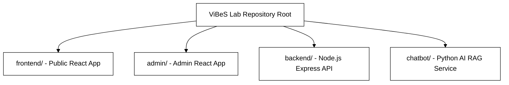
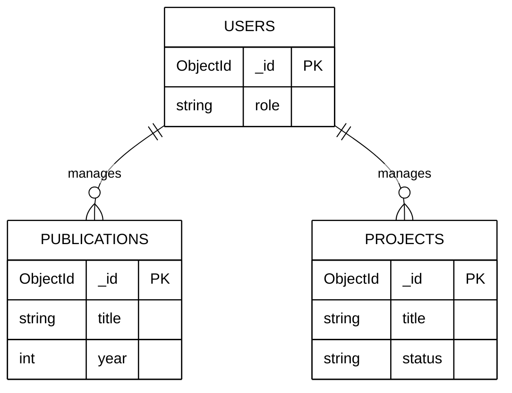
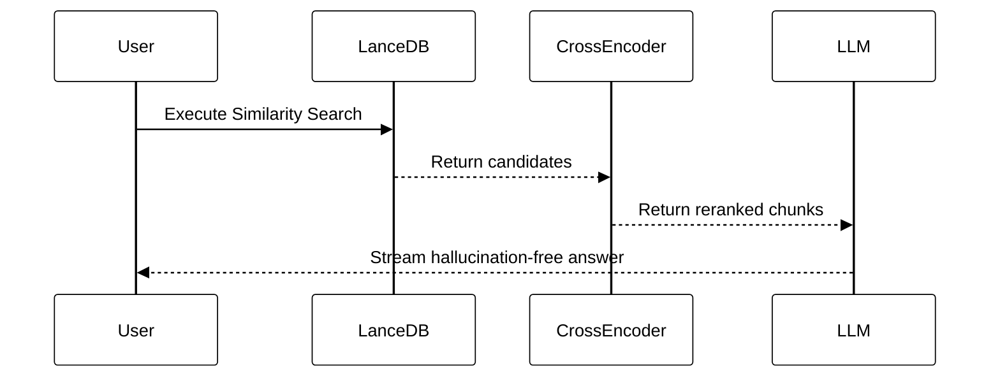
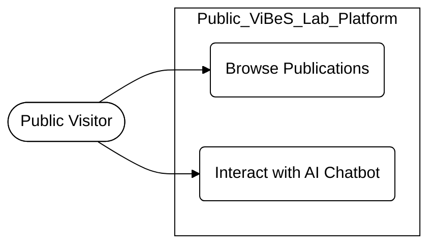
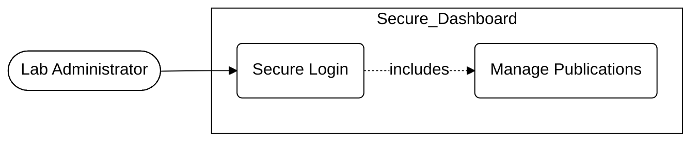

# Chapter 3

# Work Done & Implementation Details

This chapter outlines the practical implementation of the ViBeS Lab website, detailing the directory structures, database schemas, environment configurations, and the neural network models used. The system is built on a highly decoupled, microservices-inspired architecture, divided into the React frontend, administrative dashboard, Node.js REST API, and Python-based AI RAG pipeline.

## 3.1 Project Structure and Environmental Configuration

The project utilizes a monorepo structure to isolate dependencies (e.g., `node_modules` vs `venv`) while maintaining centralized version control. This ensures that the frontend and backend can be developed and scaled independently.

*(Insert **Figure 3.1: Project Directory Structure** here)*

### 3.1.1 Environment Configuration and Security
Following the "Twelve-Factor App" methodology, sensitive data like API keys and database credentials are kept out of the source code and managed via `.env` files.

*(Insert **Table 3.1: Key Environment Variables and their Purposes** here)*

| Variable Name | Component | Description and Purpose |
| :--- | :--- | :--- |
| `MONGO_URI` | Backend | Encrypted connection string for MongoDB. |
| `JWT_SECRET` | Backend | Cryptographic key for signing secure admin sessions. |
| `GOOGLE_API_KEY` | Chatbot | Authentication token for Google's Gemini LLM. |
| `PORT` | Backend / Chatbot | Network ports (e.g., 5000 for Node, 8501 for Streamlit). |

## 3.2 Database Implementation and Entity Architectures

MongoDB (NoSQL) was selected over traditional SQL databases to comfortably handle the varying structures of academic data. Mongoose (ODM) is utilized in the Node.js backend to enforce schemas and ensure data integrity.

### 3.2.1 Collection Architectures and Relationships

The database is partitioned into specific collections. While NoSQL databases lack rigid foreign keys, logical relationships are maintained by referencing unique `ObjectIds`.

*(Insert **Figure 3.2: MongoDB Database Schema and Collections** here)*

*(Insert **Table 3.2: MongoDB Collections and their Attributes** here)*

| Collection Name | Primary Purpose | Core Attributes |
| :--- | :--- | :--- |
| **Users** | Admin credentials. | `email`, `password_hash`, `role`. |
| **Publications** | Research papers. | `title`, `authors`, `year`, `link`. |
| **Projects** | Research initiatives. | `title`, `status`, `funding_agency`. |

## 3.3 RAG Pipeline and Semantic Search Implementation

The custom Retrieval-Augmented Generation (RAG) AI Chatbot avoids LLM hallucinations by ingesting proprietary lab documents, converting them into vectors, and performing semantic searches to provide context to the LLM.

### 3.3.1 Embedding Models and Data Ingestion
Text chunks are processed through a Bi-Encoder model into dense vectors and saved in LanceDB, a columnar vector database built for rapid similarity math.

*(Insert **Table 3.3: Selected Embedding Models and their Characteristics** here)*

| Model Component | Model Architecture / Type | Role in the Pipeline |
| :--- | :--- | :--- |
| **Bi-Encoder** | `sentence-transformers/all-MiniLM-L6-v2` | Converts textual chunks into dense vectors. |
| **Sparse Retriever** | BM25 (Lexical Search) | Executes traditional keyword matching. |
| **Cross-Encoder** | `cross-encoder/ms-marco-MiniLM-L-6-v2` | Computes semantic relationship scores. |
| **Generator (LLM)** | Google Gemini Flash / Ollama | Synthesizes context into a conversational response. |

### 3.3.2 Semantic Search and Cross-Encoder Reranking
When a user asks a question, the Bi-Encoder fetches candidate documents. The Cross-Encoder then deeply analyzes and scores these candidates, passing only the most accurate chunks to the final LLM.

*(Insert **Figure 3.3: Semantic Search and Cross-Encoder Reranking Process** here)*

## 3.4 System Use Cases and Actor Interactions

Unified Modeling Language (UML) Use Case diagrams map the functional permissions of the primary actors: the Public Visitor and the Administrator.

### 3.4.1 Public Visitor
The Public Visitor holds read-only permissions to explore lab outputs and chat with the AI assistant.

*(Insert **Figure 3.4: Public Visitor and Chatbot Use Case Diagram** here)*

### 3.4.2 Administrator
The Administrator bypasses the public frontend, authenticates via JWT, and possesses full CRUD privileges to update lab data.

*(Insert **Figure 3.5: Administrator Use Case Diagram** here)*

