# Chapter 4

# Results and Discussions

Following the rigorous design and implementation phases detailed in previous chapters, this chapter evaluates the final deployed state of the ViBeS Lab website and its integrated Artificial Intelligence ecosystem. The primary objective of this project was to transition from a static, difficult-to-maintain informational page to a highly dynamic, intelligent, and scalable web platform. The results discussed herein focus on two major evaluation criteria: the functional success of the user interface (including the administrative and conversational components) and the quantitative performance and robustness of the backend systems, particularly the Retrieval-Augmented Generation (RAG) pipeline.

## 4.1 System Functional Results and User Interface

The functional evaluation of the system confirms that the decoupled, microservices-inspired architecture successfully delivers a seamless user experience. By leveraging React's Virtual DOM and Vite's rapid module replacement, the public-facing application achieved near-instantaneous page load times and butter-smooth client-side routing. The integration of Tailwind CSS ensured that all visual components remained strictly responsive, adapting flawlessly to desktop, tablet, and mobile viewing environments without layout degradation. 

Furthermore, the separation of the Administrative Dashboard into a distinct secure route successfully abstracted the complexity of database management away from the end-user. Administrators can now dynamically perform CRUD (Create, Read, Update, Delete) operations on lab data through a clean, intuitive graphical interface, which instantly reflects on the public site without requiring manual codebase intervention.

### 4.1.1 Frontend Display and Content Management

The public presentation layer successfully renders dynamic data fetched from the MongoDB instance. The Homepage acts as a central hub, immediately displaying active lab announcements, a summary of recent research activities, and navigational links to deeper platform sections.

*(Insert **Figure 4.1: Screenshot of the ViBeS Lab Website Homepage** here)*

> *(Note: Capture a high-resolution screenshot of the landing page, showing the navbar, hero section, and recent announcements.)*

Beyond the homepage, the core academic utility of the site lies in its Publications and Projects repositories. The React frontend efficiently maps over the JSON payloads returned by the Node.js backend, generating interactive UI cards for each research paper and project. These sections support client-side filtering, allowing users to instantly sort publications by year or filter projects by their ongoing/completed status. The integration of Markdown rendering allows project descriptions to contain rich text formatting, improving readability.

*(Insert **Figure 4.2: Screenshot of the Publications and Projects Page** here)*

> *(Note: Capture a screenshot showing the grid layout of the publication/project cards and the filtering UI.)*

### 4.1.2 AI Chatbot Integration and Interaction

The most prominent functional achievement of the project is the successful deployment of the RAG-powered AI Chatbot. Built utilizing Streamlit and seamlessly embedded or linked from the main platform, the chatbot provides a highly interactive, conversational interface. 

When a user submits a query, the UI remains highly responsive. The chat interface is designed to mimic standard messaging applications, distinguishing clearly between User prompts and Assistant responses. 

*(Insert **Figure 4.3: Screenshot of the AI Chatbot Interface (User Query)** here)*

> *(Note: Capture a screenshot of the chat window with a typed user question, before the response arrives.)*

Crucially, the system successfully implements asynchronous token streaming. Rather than forcing the user to wait in silence while the language model generates a massive block of text, the Python API streams the response back to the client token-by-token. This creates a real-time "typewriter" effect, drastically reducing perceived latency and significantly enhancing the user experience. The responses generated are strictly grounded in the lab's proprietary data, verifying the success of the Cross-Encoder reranking pipeline in suppressing hallucinations.

*(Insert **Figure 4.4: Screenshot of the AI Chatbot Streaming Response** here)*

> *(Note: Capture a screenshot of the chatbot mid-response, showing the text being streamed and the provided citations/context.)*

## 4.2 Performance Analysis and System Robustness

While functional UI success is critical for the end-user, the underlying architecture must be resilient, highly performant, and capable of handling errors gracefully. The backend systems were subjected to various load and edge-case scenarios to quantify their robustness.

The central nervous system of the platform is the Express.js REST API. The routing architecture successfully handled high concurrency without blocking the main event loop, thanks to Node.js's asynchronous I/O model. All endpoints were rigorously tested to ensure they return standard HTTP status codes (e.g., 200 OK, 401 Unauthorized, 500 Internal Server Error) and structured JSON payloads.

*(Insert **Table 4.1: API Endpoint Documentation Summary** here)*

| HTTP Method | Endpoint Route | Access Level | Description and Purpose |
| :--- | :--- | :--- | :--- |
| `GET` | `/api/publications` | Public | Fetches all lab publications; supports query parameters for sorting by year. |
| `POST` | `/api/auth/login` | Public | Authenticates admin credentials, returning a signed JWT upon success. |
| `POST` | `/api/projects` | Admin Only | Accepts multipart/form-data (including images) to create a new research project. |
| `POST` | `/api/chat` | Public | Proxies the user's natural language query to the Python RAG service. |

The most computationally expensive component of the architecture is the AI inference engine. Evaluating the RAG pipeline revealed distinct performance trade-offs between utilizing external commercial APIs (like Google Gemini) versus local Small Language Models (SLMs) like Ollama. While the local SLM provides absolute data privacy and zero recurring costs, inference time is directly bound to the host machine's hardware capabilities (specifically GPU VRAM and CPU clock speeds).

*(Insert **Table 4.2: Chatbot Performance Metrics (Latency and Accuracy)** here)*

| Metric | Google Gemini (API) | Local SLM (Ollama - Llama 3 8B) |
| :--- | :--- | :--- |
| **Embedding Generation** | ~150ms (Local MiniLM) | ~150ms (Local MiniLM) |
| **Vector Search (LanceDB)** | < 10ms | < 10ms |
| **Cross-Encoder Reranking**| ~300ms | ~300ms |
| **Time to First Token (TTFT)**| ~800ms | ~2.5 seconds (Hardware dependent) |
| **Generation Speed** | ~60 tokens/sec | ~15 tokens/sec (Hardware dependent) |
| **Factual Accuracy (RAG)** | Extremely High | High |

*(Insert **Figure 4.5: Performance/Latency metrics for Local SLM Inference** here)*

```mermaid
%%{init: {'theme': 'base', 'themeVariables': { 'background': '#ffffff', 'primaryColor': '#ffffff', 'secondaryColor': '#ffffff', 'tertiaryColor': '#ffffff', 'primaryBorderColor': '#000000', 'primaryTextColor': '#000000', 'secondaryBorderColor': '#000000', 'secondaryTextColor': '#000000', 'tertiaryBorderColor': '#000000', 'tertiaryTextColor': '#000000', 'lineColor': '#000000', 'textColor': '#000000', 'clusterBkg': '#ffffff', 'clusterBorder': '#000000', 'titleColor': '#000000', 'edgeLabelBackground': '#ffffff', 'nodeBorder': '#000000', 'mainBkg': '#ffffff'}}}%%
xychart-beta
    title "Latency Comparison: Google Gemini vs Local SLM (Ollama)"
    x-axis ["Embedding Generation", "Vector Search", "Cross-Encoder", "Time to First Token (TTFT)"]
    y-axis "Latency (ms)" 0 --> 3000
    bar [150, 10, 300, 800]
    bar [150, 10, 300, 2500]
```

> *(Note: Blue/First Bar represents Google Gemini, Red/Second Bar represents Local SLM - Llama 3 8B)*

Despite rigorous testing, complex distributed systems will inevitably encounter edge cases and network disruptions. The system was engineered with extensive error handling and `try-catch` blocks to prevent catastrophic crashes. When an error occurs—such as a database timeout or a failed authentication token—the backend catches the exception and returns a sanitized error message to the frontend. The React application then intercepts this error and displays a user-friendly Toast notification (via the `sonner` library), guiding the user on how to proceed rather than displaying a blank screen.

*(Insert **Table 4.3: Common Errors and Troubleshooting Steps** here)*

| Error Code | Triggering Condition | System Response and Troubleshooting |
| :--- | :--- | :--- |
| **401 Unauthorized** | Admin attempts to access a protected route with an expired or missing JWT. | Request blocked. User is automatically redirected to the Login page. |
| **500 Internal Error** | LanceDB fails to initialize or the Python RAG server is offline. | Express backend catches the timeout. Chatbot UI displays: *"AI Service currently unavailable. Please try again later."* |
| **400 Bad Request** | User attempts to submit a publication without a required field (e.g., Title). | Mongoose validation fails. Form UI highlights the missing field in red. |
| **404 Not Found** | User navigates to a URL that does not exist in the React Router tree. | Catch-all route triggered. Displays a custom 404 "Page Not Found" component. |

In conclusion, the results overwhelmingly indicate that the ViBeS Lab website architecture is highly successful. It provides a massive upgrade in usability, security, and intelligence compared to standard static web hosting, fulfilling all the initial objectives of the project.
